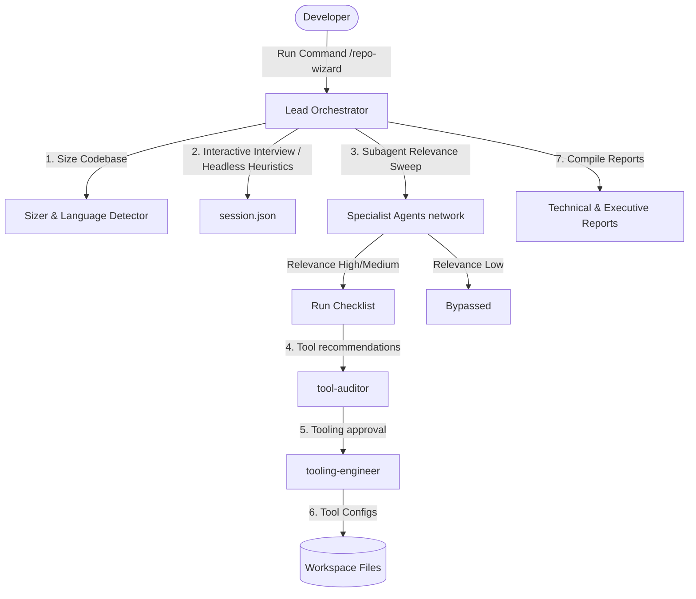

# Repo Wizard: Technical Documentation

Repo Wizard is an advanced, production-grade local workspace optimization tool and IDE plugin built natively on top of the Google Agent Development Kit (@google/adk) framework. Designed specifically for the agent-first era, Repo Wizard automates the process of code hardening by orchestrating a decoupled network of 31 specialized expert AI subagents.

By separating macro-level orchestration from localized workspace tool execution, Repo Wizard systematically reviews, audits, and hardens codebases across application security, structural resilience, and regulatory compliance—all while operating entirely within a secure, local-first sandbox environment.

---

## Technical Architecture and System Design

Repo Wizard avoids the pitfalls of long-context token bloat and non-deterministic logic by implementing a Hybrid Orchestration Model powered by the Google ADK.



1. **The Lead Orchestrator (`run-adk-orchestrator.js`)**
The central nervous system of Repo Wizard. Built using the ADK InMemoryRunner, the Orchestrator never ingests the raw codebase directly to prevent token bloat. Instead, it runs a fast, lightweight heuristic baseline scan across the local directory to compile a structural `manifest.json`. Before launching downstream agents, the Orchestrator forces a strict Zod runtime schema validation over the manifest, guaranteeing that subagents receive perfectly typed context configurations. It then outputs deterministic `AgentParameterContract` JSON objects to define specific boundary objectives for the subagents.

2. **Parallel Specialist Subagents (`subagents/`)**
Repo Wizard houses a robust library of 31 discrete expert personas (including resilience-architect, appsec-hardener, and legal-neutrality-auditor). Triggered asynchronously via `invoke_subagent` calls, these agents receive their target objectives inside their strict contract scopes. Rather than receiving code snippets over API boundaries, the subagents are granted localized absolute pathway addresses, utilizing custom tools to natively "pull" and inspect the precise files relevant to their domains.

3. **Fault Tolerance and Self-Healing Loops**
To withstand network timeouts, transient LLM failures, or API rate limitations during heavy parallel swarms, the core orchestrator runner wraps all agent execution blocks in an automated 3-attempt exponential backoff retry loop, ensuring system resilience without terminating the main development process.

---

## Hardened Security and Sandboxing Features

Repo Wizard implements an uncompromising approach to code privacy and system safety through three specific engineering guardrails:

* **Input Path Sanitization (`fs-tools.ts`)**: To neutralize malicious path traversals or malformed file configurations, all core file-system tools route through runtime regex filters that automatically strip out dangerous null-byte (`\0`) injections and anomalous whitespace padding before hitting the host OS layer.
* **Credential Data Redaction Interceptors**: The data synthesis layer includes an active outbound log interceptor. This engine scans agent-generated text streams in real-time, programmatically masking and redacting exposed API keys, environment parameters, or Git credentials before compiling reports.
* **Dynamic Temp Sandboxing**: End-to-end testing harnesses execute within isolated, dynamically generated `temp_e2e_sandbox_*/` file spaces that are automatically scrubbed upon execution termination, protecting live working branches from accidental corruption.

---

## Environment Requirements and Local Installation

Repo Wizard is built strictly as a Local Workspace Tool and IDE Plugin to preserve total IP security and code isolation. It requires no external cloud databases or cloud microservices.

### Prerequisites
* **Runtime**: Node.js (v18 or higher)
* **Package Manager**: npm
* **Core Dependencies**: Powered via `@google/adk` and `zod`

### Environment Variables
To enable the underlying evaluation runners and LLM execution loops, create a `.env` file in your root workspace and configure your secure credentials:
```env
GEMINI_API_KEY=your_secure_google_ai_studio_api_key_here
```
> [!NOTE]
> Repo Wizard includes built-in output interceptors to ensure this variable is never logged or leaked into generated workspace artifacts.

### Installation Lifecycle
1. **Clone and Install Dependencies**:
   ```bash
   npm install
   ```
2. **Register the Native Antigravity Plugin**:
   Integrate Repo Wizard directly into your Google Antigravity IDE environment using the automated registration hook:
   ```bash
   agy plugin install .
   ```
3. **Initialize Git Lifecycle Protection**:
   Run the setup utility to automatically inject pre-commit and pre-push verification hooks into your repository:
   ```bash
   # On Linux / macOS / Git Bash
   ./setup.sh
   # On Windows (PowerShell)
   .\setup.ps1
   ```

---

## Step-by-Step Execution Sequence

Repo Wizard provides a flexible, robust operational sequence that can be executed entirely via the headless CLI or through interactive IDE slash commands.

### Phase 1: Heuristic Workspace Mapping
Execute a lightning-fast sweep of the target repository to construct the structural layout:
```bash
node scripts/repo-wizard.js scan
```
**Output:** Generates a validated, Zod-verified `manifest.json` map.

### Phase 2: Orchestrated Multi-Agent Audit
Launch the parallel swarm of specialized expert agents to inspect the codebase pathways:
```bash
node scripts/repo-wizard.js run
```
**Mechanics:** Spawns the ADK InMemoryRunner, distributes typed parameter contracts, and runs specialized audits across 31 domains with active credential redaction.

### Phase 3: Deliverable Compilation
Synthesize the scattered standalone agent markdown observations into highly-polished executive insights:
```bash
node scripts/repo-wizard.js compile
```
**Output:** Employs zero-dependency data extractors to generate a unified, beautiful HTML Compliance and Engineering Report.

### Alternative: Interactive IDE Execution
Open your Google Antigravity IDE Sidebar Chat and utilize the native interactive slash shortcut:
```text
/repo-wizard
```
This triggers the identical ADK multi-agent orchestration lifecycle natively within your active editor context, leveraging our 25 individually registered slash commands.

---

## Documentation & Navigation Map

To help you get started quickly, please refer to the following guides:
* **[AGENT_MATRIX.md](docs/AGENT_MATRIX.md)** — The multi-agent taxonomy matrix mapping personas, skills, commands, and standards.
* **[getting-started.md](docs/getting-started.md)** — Core concepts and cybersecurity color-wheel categorization.
* **[GLOSSARY.md](docs/GLOSSARY.md)** — Definitions for compliance frameworks, software engineering, and AI agent terms.
* **[scripts-guide.md](docs/scripts-guide.md)** — Detailed manual for helper, compilation, and testing scripts.
* **[TESTING.md](docs/TESTING.md)** — Testing philosophy, LLM-as-a-judge evals, and troubleshooting guide.
* **[usage-tutorial.md](docs/usage-tutorial.md)** — Scenario guides for Greenfield vs. Brownfield repos, and interactive vs. headless execution.
* **[references/README.md](references/README.md)** — Alphabetized and domain-mapped catalog of the 23 checklist and pattern standards.
* **[hybrid-orchestration.md](docs/design/hybrid-orchestration.md)** — Architectural design of the manifest-driven hybrid runner and ADK execution model.
* **[adk-orchestration.md](docs/design/adk-orchestration.md)** — Integration design of the Google ADK InMemoryRunner to manage LlmAgent lifecycle and pipeline execution.
* **[passive-data-boundaries.md](docs/design/passive-data-boundaries.md)** — Security architecture detailing prompt injection mitigations and isolated data parsing.
* **[prompt-evaluations.md](docs/design/prompt-evaluations.md)** — Deep-dive on MLOps testing, rubric parity requirements, and the LLM-as-a-judge runner.
* **[zero-dependency-scripting.md](solo-dev-toolkit/docs/design/zero-dependency-scripting.md)** — Engineering rationale for zero-npm dependency Node.js utility design.
* **[tooling-and-rollback-safety.md](docs/design/tooling-and-rollback-safety.md)** — Core setup presets and Git rollback safety mechanism design.
* **[meta-agent-alignment.md](docs/design/meta-agent-alignment.md)** — Meta-agent prompt auditing linter rules and self-linting pilot design.
* **[legal-consent-gate.md](docs/design/legal-consent-gate.md)** — Design of the Step 0 terms agreement checkpoint and liability disclaimers.
* **[decoupled-orchestration.md](docs/design/decoupled-orchestration.md)** — Architectural design and lifecycle of the contract-based decoupled agent orchestration system.
* **[session-resumability.md](docs/design/session-resumability.md)** — Design and state structures of the session recovery system and subagent manifest contracts.
* **[papercut-tracking.md](solo-dev-toolkit/docs/design/papercut-tracking.md)** — Design of the subagent papercut logging and frequency tracking system.
* **[phase-splitting-tooling.md](docs/design/phase-splitting-tooling.md)** — Architectural design of the phase-splitting execution boundary and versioned JSON tooling contracts.
* **[zero-dependency-json-validation.md](docs/design/zero-dependency-json-validation.md)** — Design of the zero-dependency schema-based validation for plugin and agent configurations.
* **[markdown-duplication-validator.md](docs/design/markdown-duplication-validator.md)** — Design and processing pipeline of the DRY compliance checker for documentation and prompts.
* **[quality-pillars-framework.md](docs/design/quality-pillars-framework.md)** — Structural design of quality pillars grouping specialist agent personas.
* **[report-redaction-pipeline.md](docs/design/report-redaction-pipeline.md)** — Anonymization pipeline architecture for Git URLs, workspace paths, and repository names.
* **[pillar-concurrency-limits.md](docs/design/pillar-concurrency-limits.md)** — Resource control design for concurrency limits and sequential batching of subagent execution.
* **[repo-sizing-relevance-refactoring.md](docs/design/repo-sizing-relevance-refactoring.md)** — Technical design for proportional report requirements and setup-phase relevance checks.
* **[questionnaire-spec.md](docs/design/questionnaire-spec.md)** — Formal specification schema and validator for onboarding questionnaire structures.
* **[antigravity-setup.md](docs/antigravity-setup.md)** — Installing as an Antigravity plugin.
* **[claude-setup.md](docs/claude-setup.md)** — Loading into Claude Code.
* **[copilot-setup.md](docs/copilot-setup.md)** — Importing into GitHub Copilot.

---

## Features & Commands

### 1. Repo Wizard (`/repo-wizard`)
* **Purpose:** Runs an interactive onboarding interview with developers, dynamically recommends tailored QA, testing, security, accessibility, and compliance tools based on budget/stack constraints, and guides specialist subagents to tool them safely.
* **Orchestrator Specification:** Located in the [repo-wizard-planning/](repo-wizard-planning) directory.

### 2. Agent Alignment Auditor (`/rw-agent-alignment-auditor`)
* **Purpose:** Audits agent prompts, configurations, and workflows for consistency, style, formatting, and token limits, and configures rubric-based evaluation suites and validation checks.
* **Specialist Agent:** `agents/agent-alignment-auditor.md`
* **Skill:** `skills/agent-alignment-auditor/SKILL.md`

> [!NOTE]
> For the full list of all 31 specialized quality, performance, compliance, and security agents, please refer to the comprehensive taxonomy in [AGENT_MATRIX.md](docs/AGENT_MATRIX.md).

### 3. Helper & Validation Scripts
For a complete guide to all available helper, validation, and test runner scripts, please refer to [scripts-guide.md](docs/scripts-guide.md). 
To verify repository quality and facilitate testing of AI agent workflows:
* **Markdown-to-HTML Compiler ([solo-dev-toolkit/scripts/md-to-html.js](solo-dev-toolkit/scripts/md-to-html.js)):** A zero-dependency utility that compiles standard markdown documentation into responsive, styled HTML pages with light/dark theme support.
* **Static Linters:** Scripts to validate agent formatting ([validate-agents.js](scripts/validate-agents.js)), command parity ([validate-commands.js](scripts/validate-commands.js)), and skill layouts ([validate-skills.js](scripts/validate-skills.js)).
* **Test Runners:** Integration, contract schema checking, subagent mocking, and sandbox E2E test suites.

---

## Directory Structure

To keep the repository modular, the files are separated into the **Product Plugin** (what the end-user runs) and the **Developer Infrastructure** (the Builder tools used to write and validate the project):

### 1. Product Plugin (The Runtime)
These folders contain the code, configurations, and skills packaged and shipped as the `repo-wizard` tool:
*   `skills/` — The core audit and tooling workflows (copied into user codebases).
*   `agents/` — Reusable agent persona instructions (used during scans).
*   `commands/`, `.claude/`, `.gemini/` — CLI slash command configurations for different client environments.

### 2. Developer Infrastructure (The Builder)
These folders and files are used locally by developers and AI coding assistants to build, test, and maintain `repo-wizard`:
*   `scripts/` — Local setup, orchestration, E2E tests, and validation scripts.
*   `solo-dev-toolkit/scripts/` — Reusable, decoupled developer tools (markdown compiler and commit message validator).
*   `evals/` — LLM-as-a-judge prompt evaluation configurations.
*   [AGENTS.md](AGENTS.md) / `CLAUDE.md` — Workflow rules instructing coding assistants.
*   `docs/` — Onboarding, testing, glossary, and design specifications.

---

## Disclaimer & Legal Safety

> [!IMPORTANT]
> **No Advice Provided:** The tools, checklists, and scanning outputs generated by `repo-wizard` are educational references and engineering starting points. They do not constitute legal, financial, compliance, regulatory, or safety advice. Developers must perform their own review of recommendations, configurations, and licenses to ensure compatibility with their organizational standards and local laws.

---

## License

This project is licensed under the MIT License - see the [LICENSE](LICENSE) file for details.
