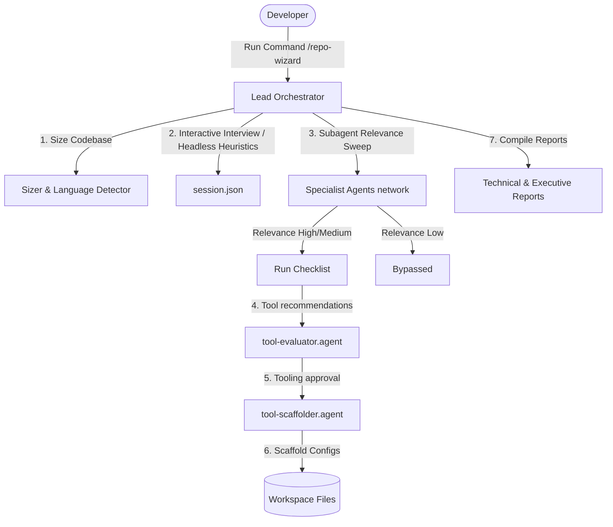

# Repo Wizard (`repo-wizard`)

Repo Wizard is a production-grade collection of governance, legal safety, regulatory compliance, testing, and documentation skills for AI coding agents (Antigravity, Claude Code, etc.). 

It packages instructions, checklists, and persona configurations that can be loaded into agents to automate complex repository auditing and scaffolding.

---

## 🗺️ Documentation & Navigation Map

To help you get started quickly, please refer to the following guides:
* **[getting-started.md](file:///d:/DevSandbox/agy-projects/repo-wizard/docs/getting-started.md)** — Core concepts and cybersecurity color-wheel categorization.
* **[GLOSSARY.md](file:///d:/DevSandbox/agy-projects/repo-wizard/docs/GLOSSARY.md)** — Definitions for compliance frameworks, software engineering, and AI agent terms.
* **[usage-tutorial.md](file:///d:/DevSandbox/agy-projects/repo-wizard/docs/usage-tutorial.md)** — Scenario guides for Greenfield vs. Brownfield repos, and interactive vs. headless execution.
* **[scripts-guide.md](file:///d:/DevSandbox/agy-projects/repo-wizard/docs/scripts-guide.md)** — Detailed manual for helper, compilation, and testing scripts.
* **[TESTING.md](file:///d:/DevSandbox/agy-projects/repo-wizard/docs/TESTING.md)** — Testing philosophy, LLM-as-a-judge evals, and troubleshooting guide.
* **[references/README.md](file:///d:/DevSandbox/agy-projects/repo-wizard/references/README.md)** — Alphabetized and domain-mapped catalog of the 23 checklist and pattern standards.

---

## ⚙️ Architecture & Orchestration Flow

Repo Wizard utilizes a multi-agent orchestration pattern where a lead orchestrator handles user onboarding and sizing checks, and coordinates specialist subagents using parameter contract validations.



---

## 🛠️ Features & Commands

### 1. Legal Neutrality Scanner (`/rw-legal-neutrality`)
* **Purpose:** Scans codebases for high-risk phrases, promises, or claims (e.g. guaranteeing security, offering unregulated fitness/health guidance) that expose the company to legal liability.
* **Specialist Agent:** `agents/legal-neutrality-agent.md`
* **Skill:** `skills/legal-neutrality-scanner/SKILL.md`
* **Reference Lookup:** [references/legal-phrasing-dictionary.md](file:///d:/DevSandbox/agy-projects/repo-wizard/references/legal-phrasing-dictionary.md)

### 2. Repo Wizard (`/repo-wizard`)
* **Purpose:** Runs an interactive onboarding interview with developers, dynamically recommends tailored QA, testing, security, accessibility, and compliance tools based on budget/stack constraints, and guides specialist subagents to scaffold them safely.
* **Orchestrator Specification:** Located in the [repo-wizard-planning/](file:///d:/DevSandbox/agy-projects/repo-wizard/repo-wizard-planning/) directory.

### 3. Agent Alignment Pilot (`/rw-agent-align`)
* **Purpose:** Audits agent prompts, configurations, and workflows for consistency, style, formatting, and token limits, and scaffolds rubric-based evaluation suites and validation checks.
* **Specialist Agent:** `agents/agent-alignment-pilot-agent.md`
* **Skill:** `skills/agent-alignment-pilot/SKILL.md`

### 4. Helper & Validation Scripts
To verify repository quality and facilitate testing of AI agent workflows:
* **Markdown-to-HTML Compiler ([scripts/md-to-html.js](file:///d:/DevSandbox/agy-projects/repo-wizard/scripts/md-to-html.js)):** A zero-dependency utility that compiles standard markdown documentation into responsive, styled HTML pages with light/dark theme support.
* **Static Linters:** Scripts to validate agent formatting ([validate-agents.js](file:///d:/DevSandbox/agy-projects/repo-wizard/scripts/validate-agents.js)), command parity ([validate-commands.js](file:///d:/DevSandbox/agy-projects/repo-wizard/scripts/validate-commands.js)), and skill layouts ([validate-skills.js](file:///d:/DevSandbox/agy-projects/repo-wizard/scripts/validate-skills.js)).
* **Test Runners:** Integration, contract schema checking, subagent mocking, and sandbox E2E test suites.

---

## 📁 Directory Structure

```
repo-wizard/
├── .claude/commands/ # Claude Code slash command configurations
├── .gemini/commands/ # Gemini CLI slash command configurations
├── agents/           # Reusable agent persona instructions
├── commands/         # Antigravity CLI slash command configurations
├── docs/             # User-facing onboarding guides
├── references/       # Detailed checklists and dictionaries
└── skills/           # Core workflows (SKILL.md per folder)
```

---

## 🚀 Installation & Setup

To automatically configure your local environment, install pre-commit git hooks, and verify code integrity:

```bash
# On Linux / macOS / Git Bash
./setup.sh

# On Windows (PowerShell)
.\setup.ps1
```

For detailed setup instructions on different client environments, see:
* [getting-started.md](file:///d:/DevSandbox/agy-projects/repo-wizard/docs/getting-started.md) — General overview.
* [antigravity-setup.md](file:///d:/DevSandbox/agy-projects/repo-wizard/docs/antigravity-setup.md) — Installing as an Antigravity plugin.
* [claude-setup.md](file:///d:/DevSandbox/agy-projects/repo-wizard/docs/claude-setup.md) — Loading into Claude Code.
* [copilot-setup.md](file:///d:/DevSandbox/agy-projects/repo-wizard/docs/copilot-setup.md) — Importing into GitHub Copilot.

---

## 📄 License

This project is licensed under the MIT License - see the [LICENSE](file:///d:/DevSandbox/agy-projects/repo-wizard/LICENSE) file for details.

