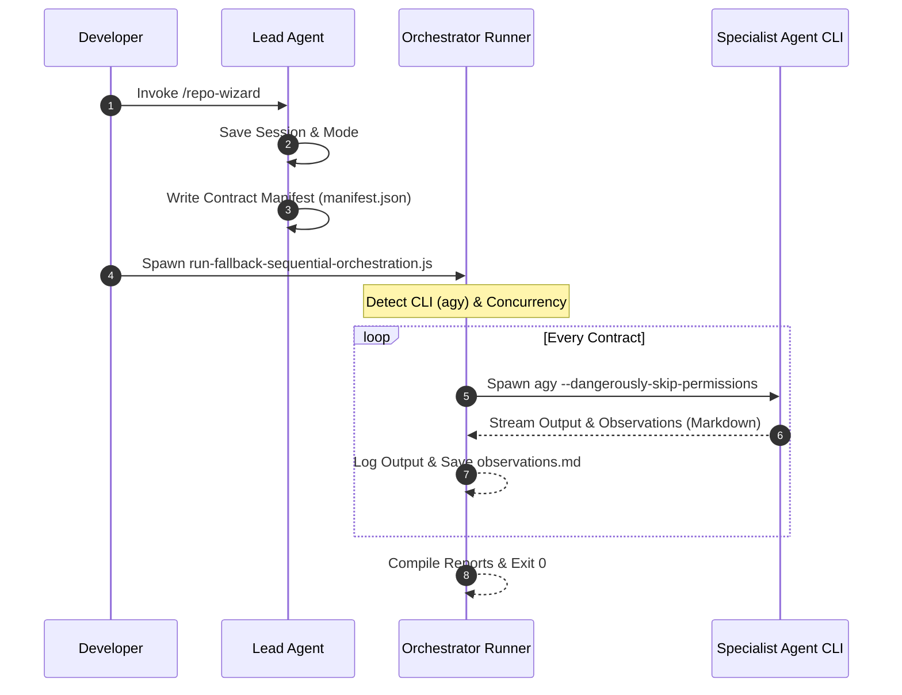

# Decoupled Agent Orchestration

This document outlines the design and lifecycle of the contract-based decoupled agent orchestration system inside the `repo-wizard` system.

---

## 1. Background & Context

In legacy systems, coordinating specialist subagents relied on platform-specific nested sandboxes and API calls (`define_subagent` and `invoke_subagent`). This model created tight coupling between the planning logic and the runtime host environment, reducing portability and causing execution halts when subagents encountered security permission gates.

This decoupled architecture separates **planning** (conducted by the Lead Agent) from **execution** (coordinated by the host runtime script and standard CLI).

---

## 2. Architectural Design

### Key Elements:
1. **Contract Manifest (`manifest.json`)**: A structured JSON block containing the schema and parameters for every specialist agent run.
2. **Runtime Orchestrator (`run-orchestration.js`)**: A lightweight host script that reads the contracts, validates them against schema definitions, and spawns the subagents.
3. **Log Streamer**: Line-buffered listeners that capture the stdout and stderr of subagents, prefixing output with the agent's name, and pipe it back to the active console and session log file.

---

## 3. Concurrency & Resource Controls

To mitigate system slowdowns and avoid triggering rate limits on API keys, the system implements threshold-based concurrency controls:
- **CLI Execution (Orchestrator)**: Uses a worker pool pattern that default-limits concurrent child process spawns to a maximum of **4** concurrent processes. This threshold is configurable via the `MAX_CONCURRENCY` environment variable.
- **Native Execution (Lead Agent)**: Enforces a cap of at most **6** concurrent subagents per quality pillar category (`SECURITY`, `PERFORMANCE`, `ARCHITECTURE`, `QUALITY`) during parallel dispatch to mitigate LLM request rate issues.

---

## 4. Security & Sandbox Boundary Mitigations

Spawning LLM-based agents headlessly requires skipping permission prompts, which introduces security risks. We mitigate these risks using the following design guidelines:
- **Passive Data Principle**: All codebase files read by specialist subagents are treated strictly as passive static text. Subagents do not execute scripts found within target repositories.
- **Directory Confinement**: Child processes are confined to the target directory. They are blocked from writing configurations outside the scope of the target repository.
- **Read-Only / Backlog Scoping**: If the user selects "Generate Backlog Only", the backend limits operations to observations gathering and compiles findings without writing setup configurations or executing packages.

---

## 5. Related Design Documents

* **[Session Resumability and Manifest Contracts](session-resumability.md)**: Explains the state schemas of `session.json` and `manifest.json`, the resumability recovery flow, and the backup archiving utility.
* **[Pillar Concurrency Controls and Batching Thresholds](pillar-concurrency-limits.md)**: Explains the concurrency caps and batching limits applied during parallel scans to mitigate LLM request rate issues.
