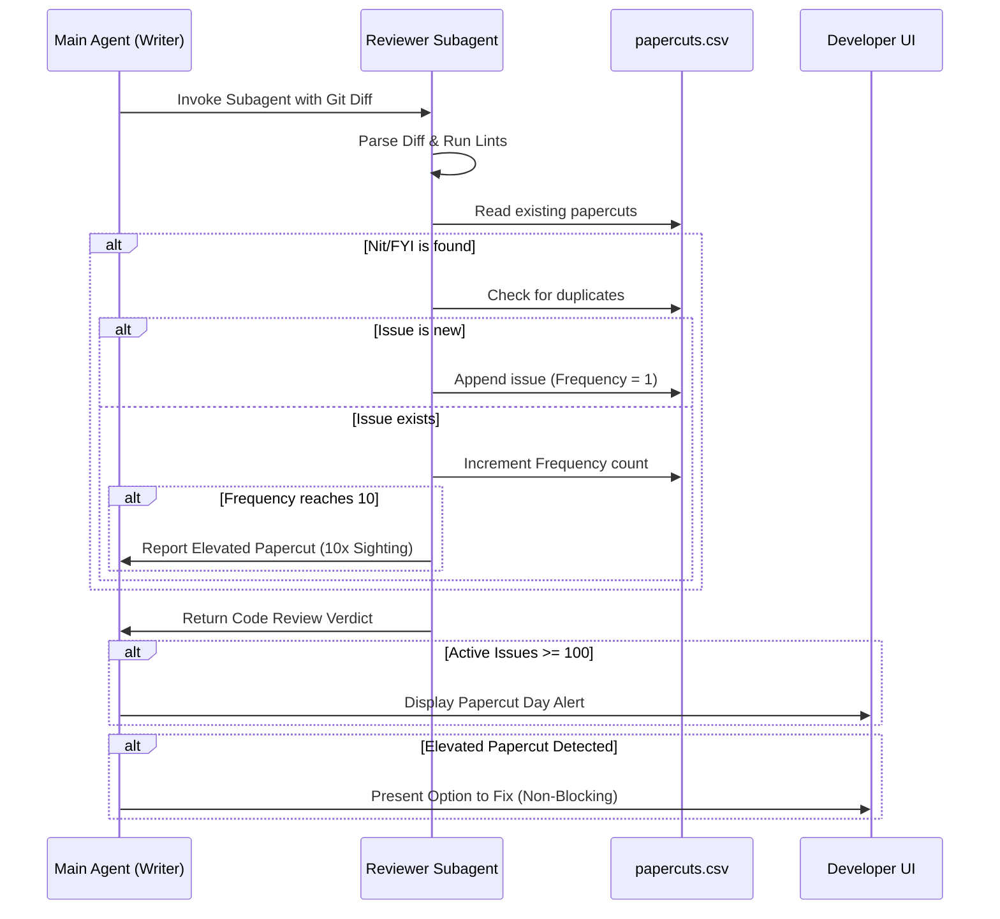

# Design Doc: Subagent Papercut Logging & Frequency Tracking

## Context & Rationale

During high-velocity agentic development, minor code issues—such as formatting inconsistencies, inline typos, non-blocking linter warnings, or low-priority logical anomalies (collectively referred to as "papercuts")—are frequently flagged. In a solo developer environment, addressing these minor issues immediately can interrupt feature development flow, while ignoring them entirely risks cumulative technical debt ("death by a thousand papercuts").

This design document outlines a lightweight, file-based mechanism to log, track, and elevate minor issues without blocking the active commit workflow, facilitating structured "cleanup sessions" or "Papercut Days."

## Architecture & Data Flow

The papercut tracking feature is integrated directly into the `rw-code-review` subagent loop.

### 1. The Papercut Log Schema (`papercuts.csv`)
Rather than relying on database storage or external issue trackers, the system logs minor issues to a local, plain-text CSV file at the project root:

| Column | Type | Description |
| :--- | :--- | :--- |
| `DateFirstSeen` | String (ISO 8601) | Date when the issue was originally identified. |
| `DateLastSeen` | String (ISO 8601) | Date when the issue was most recently identified. |
| `File` | String | Relative path to the file containing the issue. |
| `Line` | Integer | Line number containing the issue. |
| `Scope` | String | Logical area (e.g., class, function, imports) to mitigate line drift. |
| `Severity` | String | Severity label (e.g., `[Nit]` or `[FYI]`). |
| `Description` | String | A concise description of the issue. |
| `Frequency` | Integer | Number of times this exact issue has been flagged. |

### 2. Deduplication & Frequency Tracking
To mitigate file clutter, the subagent implements a deduplication check:
*   Before logging a new entry, the reviewer compares the file path and description against existing rows.
*   If a matching record exists, the system increments the `Frequency` counter and updates `DateLastSeen`.

### 3. Threshold Alerts & User Elevation
*   **The 10x Elevation Rule:** If the `Frequency` counter of any issue reaches **10**, the subagent reports this to the parent orchestrator. The parent agent presents the issue directly in the developer's chat console before the commit, providing an optional, non-blocking choice to resolve the item in a separate commit.
*   **The 100-Issue Capacity Warning:** If the total count of unique active rows in `papercuts.csv` reaches **100**, the parent agent prints a warning proposing that the developer schedule a cleanup session ("Papercut Day").

## Verification & Graceful Fallbacks

*   **Platform Portability:** If the subagent execution environment is unavailable (e.g., on platforms lacking dynamic subagent tools), the parent agent performs the CSV parsing, deduplication, and alerting directly in the primary session, maintaining feature parity.
*   **Verification Gate Integration:** The presence of minor issues or papercut alerts does not gate the build or abort the commit; only `[Critical]` and `[Important]` issues act as blocks.

## Structural Boundaries: Papercut List vs. Project Backlog

To maintain structural clarity, the system establishes a strict boundary between these two data formats:

1.  **Development-Time Papercut List (`papercuts.csv`):**
    *   *System Domain:* Builder (Development Workflow).
    *   *Target Audience:* The repository developer and development-time AI assistants.
    *   *Content:* Low-severity code formatting discrepancies, minor style adjustments, and documentation nits identified during pre-commit reviews.
    *   *Storage Location:* Stored at the workspace root as `papercuts.csv`.
2.  **Scan-Time Project Backlog (`backlog.csv`):**
    *   *System Domain:* Product (The `repo-wizard` tool execution).
    *   *Target Audience:* End-users scanning target directories.
    *   *Content:* High-level governance recommendations, regulatory compliance findings, and automated configuration scaffolding proposals grouped by Priority (`High`, `Medium`, `Low`).
    *   *Storage Location:* Stored inside the output directory of the scanned project at `.repo-wizard/backlog.csv`.

## Future Product Roadmap: `rw-papercut-exporter`

While this design currently serves the development workflow (the Builder), the architecture is designed for eventual packaging as a product feature. 

Once testing and core features are completed, the `repo-wizard` tool will expose an automated `rw-papercut-exporter` command. This command will audit the product's `backlog.csv` (which includes a `Priority` column) and extract all low-priority/minor issues (where `Priority = 'Low'`) into a developer's local `papercuts.csv` file, providing solo developers and teams with the same structured cleanup capabilities.
