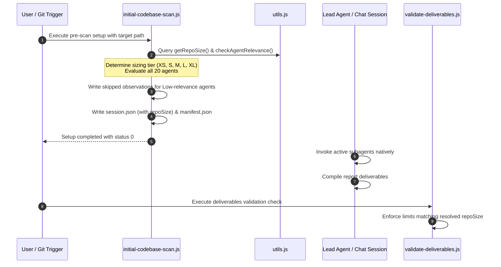

# Repo Sizing & Relevance Refactoring

This document outlines the design and implementation details for scaling deliverables validation limits (Repo Sizing), decoupling the subagent relevance sweep to run during the initial pre-scan setup phase, and consolidating helper logic into a unified utilities module.

---

## 1. Background & Context

Previously, the `repo-wizard` system enforced a flat minimum word count constraint (800 words) on all compiled report sections. For smaller codebases (e.g., retro-computing repositories with under 10 files), this fixed constraint forced the compilation of generic or padded text to pass the deliverables validator.

Additionally, the subagent relevance sweep was executed inline during sequential orchestration or required the Lead Agent to launch multiple concurrent subagents to verify relevance. This increased execution latency and potential API rate-limit exhaustion.

This refactoring introduces:
1. **Dynamic Repo Sizing:** Scaling report length verification dynamically based on codebase LOC and file count thresholds.
2. **Pre-Scan Relevance Sweep:** Running relevance evaluations during the initial setup scan phase and pre-populating the manifest state.
3. **Consolidated Helper APIs:** Unifying common helper logic to support both CLI runners and native sandbox environments.

---

## 2. Architectural Design

The updated execution lifecycle decouples size determination and relevance sweeps to occur during the initial setup scan, before subagents are invoked:

### Key Elements:

1. **Shared Utilities Module (`scripts/utils.js`)**: Encapsulates target directory traversal logic, agent relevance checks, and repo size classification formulas.
2. **Dynamic Repo Size Categorization:** Classifies repositories into one of five size tiers based on volume:
   * **XS** (< 1,000 LOC *or* < 10 files)
   * **S** (1,000 - 10,000 LOC)
   * **M** (10,000 - 50,000 LOC)
   * **L** (50,000 - 150,000 LOC)
   * **XL** (> 150,000 LOC)
3. **Pre-Populated Manifests:** The setup scan writes the relevance evaluation results directly to `manifest.json`, marking `Low` relevance agents as `skipped` on startup and pre-generating their skipped observations files.

---

## 3. Mitigation of Fabrication Risks

Enforcing rigid, high-volume word count limits on tiny codebases triggers a high probability of simulated or padded reports. To mitigate this:
* **Proportional Constraints:** By adjusting the validation limits down to matching ranges (e.g., 150 - 450 words for XS repositories), subagents can report concise, authentic codebase observations without generating filler text.
* **Repetition & Template Detection:** The deliverables validator enforces checks against serial template loops (e.g., iteration indices or boilerplate sentences) to verify that the generated text remains natural and representative of the codebase.

---

## 4. Environment Autodetection

Both `initial-codebase-scan.js` and the orchestrator utilize the unified environment check to detect Google Antigravity chat sandbox environments (via `process.env.ANTIGRAVITY_AGENT === '1'`). When detected, the setup scanner automatically configures contracts in the manifest to `pending_agent_fallback` to prompt the Lead Agent for native parallel invocation of only the active agents.

---

## 5. Related Specifications

* **[Decoupled Agent Orchestration](decoupled-orchestration.md)**: Describes the contract manifest execution flow and processes spawning limits.
* **[Session Resumability](session-resumability.md)**: Explains session backup archiving and resume state checks.
