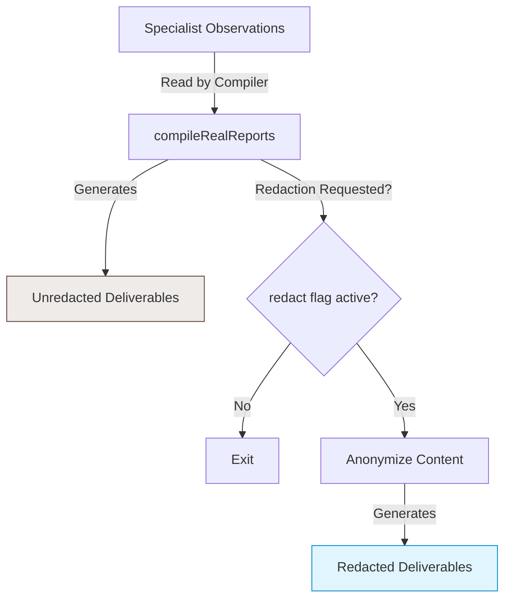

# Report Redaction and Metadata Anonymization Pipeline

This document details the architecture, design, and file-coexistence strategy of the report redaction and metadata anonymization pipeline within the `repo-wizard` system.

---

## 1. Background & Motivation

When conducting codebase sweeps and quality audits, the system records local environmental data including repository names, working directory paths, and remote Git URLs. This metadata is included in compiled deliverables to assist developers in mapping findings to local files.

However, sharing these deliverables with external parties or archiving them in public systems can expose internal names and paths. To mitigate this concern, the system provides a metadata anonymization pipeline.

---

## 2. Architectural Design & Coexistence Strategy

Rather than mutating the original observations or in-place overwriting compiled documents (which would destroy the unredacted context), the system employs a coexistence-based redaction strategy.

### Key Behaviors:
1. **Unredacted Preservation**: The primary deliverables (`<repo-name>-executive-summary.md` and `<repo-name>-full-report.md`) are always written containing the authentic repository name, paths, and URLs to support high local developer utility.
2. **On-Demand Coexistence**: When the `--redact` flag is active (or set via `session.redact`), the compiler generates redacted counterparts in the same output directory:
   - `redacted-executive-summary.md` (and `.html`)
   - `redacted-<repo-name>-full-report.md` (and `.html`)
3. **Internal Anchor Translation**: Anchor links within `redacted-executive-summary.md` pointing to the full report are translated dynamically to point to the `redacted-` filenames instead of the unredacted ones.
4. **Zero-Execution Overhead**: Because observations are stored in their raw, unredacted state, the user can generate redacted reports retroactively by running `node scripts/reports-compile.js --redact` without needing to re-run the time-consuming specialist scans.

---

## 3. Redaction Mechanics

Redaction is executed via standard text replacement rules defined in `scripts/redactor.js`. The pipeline focuses on three primary information thresholds:

### 3.1 Git URL Anonymization
Detects repository URLs (HTTP, HTTPS, SSH formats) and maps them to a generic structure:
- *Input*: `git@github.com:my-org/my-private-repository.git`
- *Output*: `git@github.com:redacted-org/redacted-repo.git`

### 3.2 Workspace Path Mitigation
Extracts the target workspace directory path (resolved dynamically during setup) and replaces all platform-specific instances (forward slashes, backslashes, double backslashes) with a generic label:
- *Input*: `D:\DevSandbox\agy-projects\repo-wizard`
- *Output*: `target-workspace-path`

### 3.3 Repository Name Anonymization
Replaces occurrence variants of the repository name (including kebab-case, space-separated, and flat variants) inside text payloads:
- *Input*: `repo-wizard`
- *Output*: `target-repository`

---

## 4. Verification and Validation

The redaction mechanism is validated through automated test suites:
- **Mock Execution Checks**: `tests/orchestration.test.js` invokes mock sweeps with `REDACT=true` and verifies that compiled redacted copies match expected anonymized formats while unredacted files preserve original details.
- **End-to-End Compliance**: Sandbox integration checks confirm that all outputs, including HTML formatting, render correctly and do not raise validation errors in the deliverables linter.
