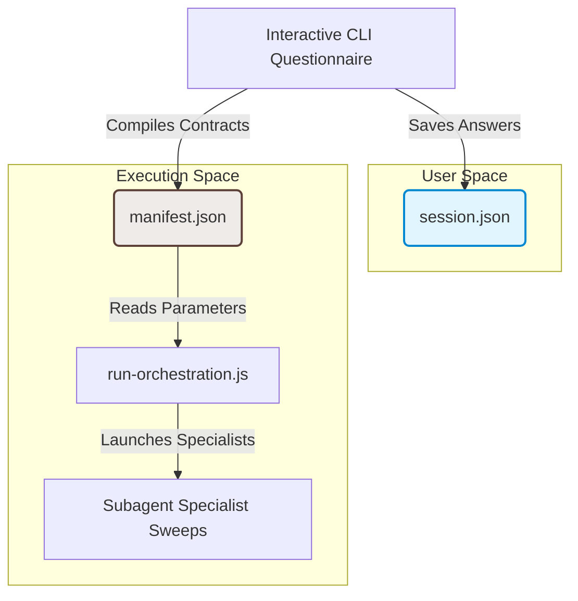

# Session Resumability and Manifest Contracts

This document describes the design, state structures, and lifecycle of the session recovery (resumability) system and the contract manifest bridge within the `repo-wizard` system.

---

## 1. Background & Context

Interactive repository auditing can be a multi-step process with potential interruptions (e.g., terminal restarts, CLI updates, or manual review intervals). To support a smooth developer experience without forcing a restart of the entire questionnaire, the system implements a session recovery mechanism. 

Furthermore, to maintain clean boundaries between user configuration choices and subagent execution inputs, the architecture splits state management into two distinct files: `session.json` and `manifest.json`.

---

## 2. State Decoupling Architecture

The system segregates developer preferences from subagent instructions using two complementary files.



### 2.1 User Session State (`session.json`)
Located at `.repo-wizard/session.json`, this file serves as the source of truth for the developer's interactive session progress and answers. It enables session recovery during subsequent executions.

Key fields in `session.json`:
* `status`: Indicates whether the session is `incomplete` or `completed`.
* `currentStep`: Tracks the active phase or question index.
* `answers`: A key-value map storing developer choices across the configuration categories (e.g., `context`, `compliance`, `stack`, `friction`).

*Example session.json structure:*
```json
{
  "status": "completed",
  "currentStep": "friction",
  "answers": {
    "targetAudience": "production-service",
    "complianceTargets": ["soc2", "gdpr"],
    "enabledCategories": ["vcs-workflow", "legal-neutrality-scanner"],
    "scaffoldingMode": "backlog"
  }
}
```

### 2.2 Execution Manifest (`manifest.json`)
Located at `.repo-wizard/manifest.json`, this file contains the compiled technical contract parameters for each selected specialist subagent. It decouples user-facing selections from execution payloads, allowing the orchestrator script (`run-orchestration.js`) to invoke agents independently of the interactive CLI questionnaire.

Key fields in `manifest.json`:
* `repoName`: The folder name of the scanned repository.
* `mode`: The active execution profile (`backlog` or `scaffolding`).
* `contracts`: A map of subagent names to their target parameter configurations (e.g., file paths, rules, compliance frameworks).

*Example manifest.json structure:*
```json
{
  "repoName": "my-application",
  "mode": "backlog",
  "contracts": {
    "legal-neutrality-agent": {
      "status": "pending_agent_fallback",
      "params": {
        "keywords": ["warning", "caution", "advice"],
        "targetExtensions": [".js", ".jsx", ".md"]
      }
    },
    "vcs-workflow-agent": {
      "status": "completed",
      "params": {
        "vcs": "git",
        "commitCheckType": "conventional-commit",
        "setupHookType": "husky"
      }
    }
  }
}
```

---

## 3. Session Recovery (Resumability) Lifecycle

When the `repo-wizard` command is invoked, the orchestrator checks for the existence of `.repo-wizard/session.json` to determine the startup path:

1. **Detection**: If `.repo-wizard/session.json` is missing, the system starts a fresh session.
2. **Action Prompting**: If a session file is detected:
   * **Incomplete Session**: The user is prompted to:
     * *Resume*: Load answers and pick up from the last completed question.
     * *Revisit*: Review or modify previous answers.
     * *Start Fresh*: Archive the active state and initialize a new questionnaire.
   * **Completed Session**: The user is prompted to:
     * *Revisit*: Inspect or modify answers from the last run.
     * *Report*: Output the locations of previously generated reports.
     * *Start Fresh*: Archive the active state and initialize a new questionnaire.
3. **Archiving History**: When the user chooses to "Start Fresh" or modify configuration settings, the active state is backed up to mitigate overwrites. The `scripts/reports-archive.js` utility script copies `session.json`, `manifest.json`, and all Markdown/HTML reports to the `.repo-wizard/reports/history/<repoName>/<timestamp>/` directory. Each file is suffixed with `_YYYYMMDD_HHMMSS` based on its last modified timestamp to maintain accurate file age records.

---

## 4. Relationship to Other Design Documents

This state and recovery system complements other core parts of the architecture:
* **[Decoupled Agent Orchestration](decoupled-orchestration.md)**: Explains how the contract parameters defined in `manifest.json` are read and executed asynchronously by the host runner without platform-specific nesting.
* **[Hybrid Orchestration Runner](hybrid-orchestration.md)**: Explains the execution state loop of `run-orchestration.js` and how it updates contract statuses in `manifest.json`.
* **[Scaffolding & Rollback](scaffolding-and-rollback-safety.md)**: Describes how the workspace is restored to a clean state if the subagent configurations generated from the manifest contracts fail verification builds.
