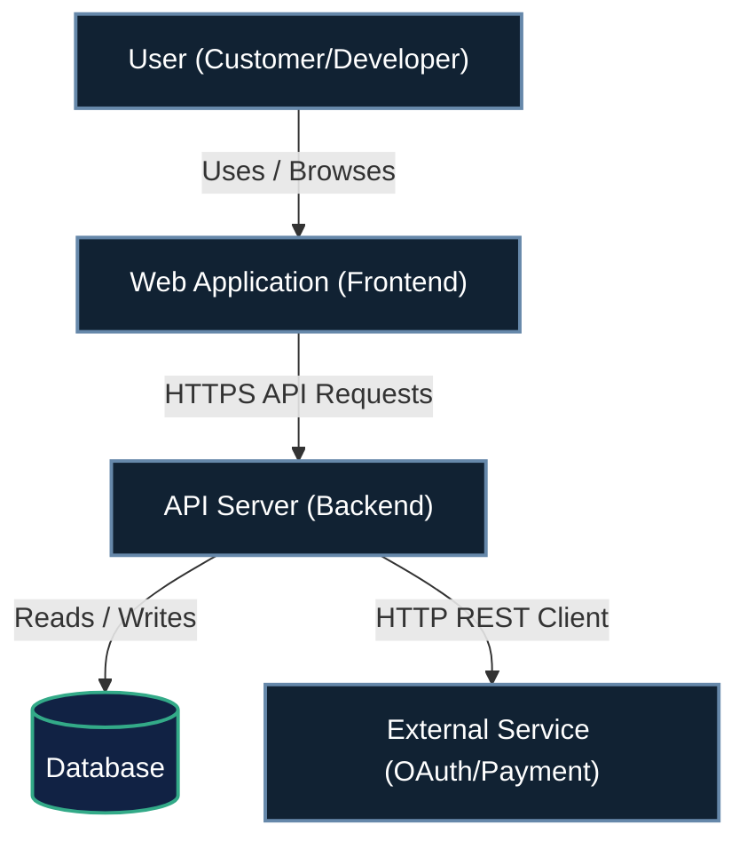

# Repository Documentation & Architecture Standards

This document serves as the repository's source of truth for architectural decision records (ADRs), system context/container visualization diagrams, incident post-mortems, and sprint retrospectives.

---

## 1. Nygard Architecture Decision Record (ADR) Schema

All architectural decisions must be recorded in sequential Markdown files under `docs/decisions/` (e.g., `0001-record-architecture-decisions.md`). Each file must adhere to the standard Nygard format:

```markdown
# [Number]. [Short Title of Decision]

* **Status:** [ Proposed | Accepted | Rejected | Deprecated | Superseded by [ADR-XXXX](file:///path/to/ADR) ]
* **Deciders:** [ List of team members / roles involved ]
* **Date:** [ YYYY-MM-DD ]

## Context and Problem Statement

[ Describe the context, background, and the specific technical problem being solved. What forces are at play? Include any technical or business constraints. ]

## Decision Drivers

* [ Driver 1, e.g., low-latency requirements ]
* [ Driver 2, e.g., ease of maintainability ]

## Considered Options

1. [ Option 1 Name & Brief Description ]
2. [ Option 2 Name & Brief Description ]

## Decision Outcome

Chosen option: **[ Option Name ]**, because [ explanation of why this option was chosen over others, referencing decision drivers ].

### Positive Consequences

* [ Positive consequence 1 ]
* [ Positive consequence 2 ]

### Negative Consequences

* [ Negative consequence / trade-off 1 ]
* [ Negative consequence / trade-off 2 ]

## Pros and Cons of the Options

### [ Option 1 ]
* **Pros:** [ List pros ]
* **Cons:** [ List cons ]

### [ Option 2 ]
* **Pros:** [ List pros ]
* **Cons:** [ List cons ]
```

---

## 2. ADR Generator Script Skeletons

To simplify creating new ADR files, teams can implement one of the following generator scripts in their repository root or scripts directory. The script must accept a title, determine the next sequence number, and generate a populated template.

### 2.1 Bash Shell Script (`scripts/new-adr.sh`)
```bash
#!/usr/bin/env bash
set -euo pipefail

DECISIONS_DIR="docs/decisions"
mkdir -p "$DECISIONS_DIR"

if [ -z "${1:-}" ]; then
  echo "Usage: $0 <title>"
  exit 1
fi

TITLE="$1"
SLUG=$(echo "$TITLE" | tr '[:upper:]' '[:lower:]' | tr -s ' ' '-' | tr -cd 'a-z0-9-')

# Find next number
LATEST_NUM=$(find "$DECISIONS_DIR" -name "[0-9][0-9][0-9][0-9]-*.md" | sort | tail -n 1 | grep -o "[0-9]\{4\}" || true)
if [ -z "$LATEST_NUM" ]; then
  NEXT_NUM="0001"
else
  NEXT_NUM=$(printf "%04d" $((10#$LATEST_NUM + 1)))
fi

FILE_NAME="${DECISIONS_DIR}/${NEXT_NUM}-${SLUG}.md"

cat <<EOF > "$FILE_NAME"
# ${NEXT_NUM}. ${TITLE}

* **Status:** Proposed
* **Deciders:** $(git config user.name || echo "Developer")
* **Date:** $(date +%Y-%m-%d)

## Context and Problem Statement
[ Context details here... ]

## Decision Drivers
* [ Driver 1 ]

## Considered Options
1. [ Option 1 ]

## Decision Outcome
Chosen option: [ Choice ], because [ reason ].
EOF

echo "Scaffolded ADR at: $FILE_NAME"
```

### 2.2 Python Script (`scripts/new_adr.py`)
```python
#!/usr/bin/env python3
import sys
import os
import re
from datetime import datetime

DECISIONS_DIR = "docs/decisions"

def main():
    if len(sys.argv) < 2:
        print("Usage: python3 new_adr.py <title>")
        sys.exit(1)
        
    title = sys.argv[1]
    os.makedirs(DECISIONS_DIR, exist_ok=True)
    
    # Calculate slug
    slug = re.sub(r'[^a-z0-9-]', '', title.lower().replace(' ', '-'))
    slug = re.sub(r'-+', '-', slug)
    
    # Find next number
    existing_files = [f for f in os.listdir(DECISIONS_DIR) if re.match(r'^\d{4}-.*\.md$', f)]
    if not existing_files:
        next_num = 1
    else:
        existing_files.sort()
        last_file = existing_files[-1]
        next_num = int(last_file.split('-')[0]) + 1
        
    next_num_str = f"{next_num:04d}"
    filename = os.path.join(DECISIONS_DIR, f"{next_num_str}-{slug}.md")
    
    template = f"""# {next_num_str}. {title}

* **Status:** Proposed
* **Deciders:** Developer
* **Date:** {datetime.now().strftime('%Y-%m-%d')}

## Context and Problem Statement
[ Describe context and problem statement here... ]

## Decision Drivers
* [ Driver 1 ]

## Considered Options
1. [ Option 1 ]

## Decision Outcome
Chosen option: [ Choice ], because [ reason ].
"""
    
    with open(filename, 'w') as f:
        f.write(template)
        
    print(f"Scaffolded ADR at: {filename}")

if __name__ == '__main__':
    main()
```

### 2.3 Node.js Script (`scripts/new-adr.js`)
```javascript
#!/usr/bin/env node
const fs = require('fs');
const path = require('path');

const DECISIONS_DIR = path.join(process.cwd(), 'docs', 'decisions');

const title = process.argv.slice(2).join(' ');
if (!title) {
  console.log('Usage: node scripts/new-adr.js <title>');
  process.exit(1);
}

fs.mkdirSync(DECISIONS_DIR, { recursive: true });

const slug = title.toLowerCase().replace(/[^a-z0-9]+/g, '-').replace(/(^-|-$)/g, '');

const files = fs.readdirSync(DECISIONS_DIR).filter(f => /^\d{4}-.*\.md$/.test(f));
let nextNum = 1;
if (files.length > 0) {
  files.sort();
  const lastFile = files[files.length - 1];
  nextNum = parseInt(lastFile.split('-')[0], 10) + 1;
}

const nextNumStr = String(nextNum).padStart(4, '0');
const filePath = path.join(DECISIONS_DIR, `${nextNumStr}-${slug}.md`);

const template = `# ${nextNumStr}. ${title}

* **Status:** Proposed
* **Deciders:** Developer
* **Date:** ${new Date().toISOString().split('T')[0]}

## Context and Problem Statement
[ Describe context and problem statement here... ]

## Decision Drivers
* [ Driver 1 ]

## Considered Options
1. [ Option 1 ]

## Decision Outcome
Chosen option: [ Choice ], because [ reason ].
`;

fs.writeFileSync(filePath, template, 'utf8');
console.log(`Scaffolded ADR at: ${filePath}`);
```

---

## 3. C4 Model Mermaid Diagram Standards

When creating software architecture diagrams in Markdown, teams must use GFM-compatible Mermaid blocks conforming to the C4 Model levels.

### 3.1 System Context Diagram (Level 1)


---

## 4. Incident Post-Mortem Template

Incident Post-Mortems are written following a production bug-fix or service interruption to identify the root cause, establish a timeline, and track preventative action items.

File path convention: `docs/post-mortems/YYYY-MM-DD-incident-summary.md`

```markdown
# Incident Post-Mortem: [YYYY-MM-DD] [Brief Incident Title]

* **Status:** [ Open | Resolved | Action Items Scheduled ]
* **Incident Commander / Lead:** [ Name / Role ]
* **Date of Incident:** [ YYYY-MM-DD ]

## Incident Summary

[ Write a 2-3 sentence overview of the incident. What was the impact, who was affected, and what was the high-level cause? ]

## Timeline

* **[YYYY-MM-DD HH:MM UTC]** - [ Description of event, e.g., deploy of version X ]
* **[YYYY-MM-DD HH:MM UTC]** - [ Incident detected by automated monitoring / user report ]
* **[YYYY-MM-DD HH:MM UTC]** - [ Investigation started by on-call engineer ]
* **[YYYY-MM-DD HH:MM UTC]** - [ Mitigation applied (e.g., rolled back, database patched) ]
* **[YYYY-MM-DD HH:MM UTC]** - [ Full recovery confirmed and normal operations resumed ]

## Root Cause Analysis (RCA)

[ Explain in detail the technical failure path. Why did the issue occur? If helpful, run a "5 Whys" analysis. Why did our automated tests, linting, or CI/CD pipelines fail to catch it before deployment? ]

## Resolution and Mitigation

[ Describe how the incident was mitigated and resolved. What commands were run, or what quick-fixes were deployed to restore service? ]

## Action Items & Prevention

Define trackable issues to prevent this incident class from occurring again.

| Action Item | Owner | Target Date | Ticket / Issue Link |
| :--- | :--- | :--- | :--- |
| [e.g. Add integration test for boundary case X] | [Name] | [YYYY-MM-DD] | [#1234](file:///path/to/issue) |
| [e.g. Configure health check alerts for endpoint Y] | [Name] | [YYYY-MM-DD] | [#1235](file:///path/to/issue) |
```

---

## 5. Cycle/Sprint/Feature Retrospective Template

Retrospectives are run at the end of a sprint, work cycle, or major feature release to gather feedback on the engineering process, communication, and tooling.

File path convention: `docs/retrospectives/sprint-XX-retrospective.md`

```markdown
# Retrospective: [Sprint / Cycle / Feature Name]

* **Facilitator:** [ Name ]
* **Participants:** [ Team name or list of attendees ]
* **Date:** [ YYYY-MM-DD ]

## 1. Retrospective Dashboard

Briefly summarize the sprint/cycle parameters:
* **Planned Scope:** [ Summary of main objectives / story points ]
* **Completed Scope:** [ Deliverables completed ]
* **Carryover / Blocked Items:** [ What didn't get done and why ]

## 2. Process & Tooling Review

Evaluate what went well and what encountered friction:
* **Development Flow:** [ Was code reviews slow? Did branch merges conflict? ]
* **Test & Build Pipeline:** [ Were tests flaky? Did build scripts fail local vs CI? ]
* **Requirements & Spec Quality:** [ Were specifications clear, or did we experience scope creep? ]

## 3. Sprint Ritual: Stop, Start, Continue, Kudos

### Stop
*What are we currently doing that is causing issues, wasting time, or adding friction? We should commit to stopping this immediately.*
* [ Stop item 1, e.g. committing directly to main without PR review ]
* [ Stop item 2 ]

### Start
*What new practices, scripts, tools, or communication habits should we adopt next cycle?*
* [ Start item 1, e.g. using the ADR CLI helper to document major refactors ]
* [ Start item 2 ]

### Continue
*What went exceptionally well that we should keep doing as a team pattern?*
* [ Continue item 1, e.g. writing robust unit tests during development ]
* [ Continue item 2 ]

### Kudos 
*Recognize and celebrate team wins, positive contributions, and peer support (kudos).*
* **Kudos to [Teammate Name]** for [specific action/help, e.g., jumping on a call to debug a complex test run].
* **Kudos to [Teammate Name]** for [specific action/help].

## 4. Retrospective Action Items

Concrete improvements to apply in the next cycle:

| Continuous Improvement Task | Owner | Target Cycle / Date | Ticket / PR Link |
| :--- | :--- | :--- | :--- |
| [e.g., Scaffold default Github PR description template] | [Name] | Next Sprint | [#567](file:///path/to/pr) |
```

---

## 6. Pull Request Checklists

To enforce compliance, bug-fixes and documentation updates must include the following headers in their pull request descriptions.

### Bug-Fix PR Checklist
```markdown
## Bug-Fix Verification
- [ ] Automated tests reproducing the failure have been added and pass.
- [ ] Incident Post-Mortem has been filed under `docs/post-mortems/` (if production incident).
- [ ] Verification builds run successfully on clean working tree.
```

### Documentation & ADR PR Checklist
```markdown
## Documentation Compliance
- [ ] ADR has been created using `00XX-` numbering convention under `docs/decisions/` (if architectural change).
- [ ] Mermaid diagrams have been validated for syntax correctness.
- [ ] No absolute system paths are used in markdown files.
```
