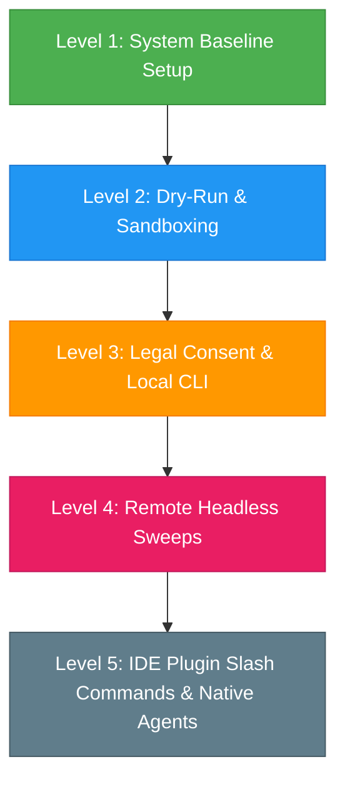

# Master Manual Test Plan & Regression Checklist

This document is the high-level manual testing index for **Repo Wizard** (`repo-wizard`). It is designed to verify the entire system from core baselines up to live agent workflows, CLI integrations, and validation gates.

Detailed step-by-step procedures for individual complex features are located in [tests/manual/features/](features/).

---

## Testing Order Roadmap

To verify components incrementally and mitigate integration risks, execute tests in this order:



---

## Level 1: System Baseline & Environment Setup (Quick & Local)

**Goal**: Verify that your developer environment is correctly bootstrapped, git hooks are active, and the core zero-dependency utilities execute.

- [ ] **1.1 Prerequisite Setup Script**
  - Run the local setup script in your terminal:
    - On PowerShell: `.\setup.ps1`
    - On Bash/macOS: `./setup.sh`
  - *Expected Outcome*:
    - Verification logs checking for Node.js, Git, and NPM.
    - Prints: `✓ Environment pre-flight checks passed successfully.`
    - Prints: `✓ Git hook installation complete.`

- [ ] **1.2 Static Linters & Code Integrity Gates**
  - Run all four static validation scripts:
    ```bash
    node scripts/validate-agents.js
    node scripts/validate-commands.js
    node scripts/validate-skills.js
    node scripts/validate-project-docs.js
    ```
  - *Expected Outcome*:
    - `validate-agents.js`: Outputs checked agent list and returns `0 error(s) found`.
    - `validate-commands.js`: Outputs `25 commands checked — 0 error(s) — PASSED`.
    - `validate-skills.js`: Outputs `28 skills checked — 0 error(s) found`.
    - `validate-project-docs.js`: Outputs `✓ All documentation upkeep audits passed successfully.`

- [ ] **1.3 Zero-Dependency Markdown-to-HTML Compiler**
  - Compile a test guide to HTML:
    ```bash
    node solo-dev-toolkit/scripts/md-to-html.js docs/getting-started.md docs/getting-started.html
    ```
  - *Expected Outcome*:
    - Terminal prints: `Successfully compiled: getting-started.md -> getting-started.html`.
    - Open `docs/getting-started.html` in your browser; verify it renders with premium dark-themed styling, headings, and tables.
    - Run `git status` and verify `docs/getting-started.html` does **not** show up as an untracked file (fully ignored by `.gitignore`).

---

## Level 2: Dry-Run Integration & Sandbox Testing (Mocks)

**Goal**: Verify that subagent parallel spawning, contract schemas, git rollbacks, and sandboxes work in mock mode without invoking external APIs.
*For detailed step-by-step procedures, see [features/scaffolding-rollback.md](features/scaffolding-rollback.md) and [features/prompt-injection.md](features/prompt-injection.md).*

- [ ] **2.1 Contract Schema Validation & Mocking Harness**
  - Run the contract validation and mock sweep harness:
    ```bash
    node scripts/validate-contracts.js
    node scripts/run-mock-harness.js
    ```
  - *Expected Outcome*:
    - `validate-contracts.js`: Outputs `All contract validator self-tests passed.`
    - `run-mock-harness.js`: Simulates 18 specialist contracts in both scaffold and backlog mode.
    - Verify that mock report files are generated at `.repo-wizard/agents/observations-*-temp_mock_repo.md`.

- [ ] **2.2 E2E Sandbox Test Runner**
  - Run the integration test suite:
    ```bash
    node scripts/run-e2e-tests.js
    ```
  - *Expected Outcome*:
    - Spawns an isolated `temp_e2e_sandbox/` workspace.
    - Runs all 16 test assertions (including Git hygiene, history archiving, presets, parallel tasks, and prompt injection filters).
    - Prints: `E2E Sandbox tests complete: 16 / 16 assertions passed.`

---

## Level 3: Legal Consent & Local CLI Sweeps (Real Execution)

**Goal**: Verify that the Step 0 Consent Gate blocks unauthorized scans, prompts for acceptance, writes the state file, and executes a local headless scan with TTY/non-TTY detection.
*For detailed step-by-step procedures, see [features/hybrid-orchestration.md](features/hybrid-orchestration.md).*

- [ ] **3.1 Step 0 Legal Consent Gate Block**
  - Delete the consent agreement file if it exists:
    ```bash
    # PowerShell
    Remove-Item -Path .repo-wizard/.tos_agreed -ErrorAction SilentlyContinue
    # Bash
    rm -f .repo-wizard/.tos_agreed
    ```
  - Trigger a scan in your terminal using the Antigravity CLI:
    ```bash
    agy --dangerously-skip-permissions -p "/repo-wizard"
    ```
  - *Expected Outcome*:
    - The agent halts execution immediately, displays the standard disclaimer, and prompts: `Do you accept these terms? (y/N)`.
    - Respond with `n`. The command must exit with a refusal error and **not** run any scan.

- [ ] **3.2 Step 0 Consent Acceptance**
  - Run the scan command again. When prompted, type `y` and press Enter.
  - *Expected Outcome*:
    - Creates a JSON file at `.repo-wizard/.tos_agreed` containing the agreement details.
    - The scan proceeds past Step 0 into Step 1.

- [ ] **3.3 Unified Codebase Setup & Scan Phase (Mandatory Setup)**
  - Before running the orchestrator script, run the pre-scan setup:
    ```bash
    node scripts/initial-codebase-scan.js
    ```
  - *Expected Outcome*:
    - Script generates the initial manifest files in `.repo-wizard/` and exits with code `0`.

- [ ] **3.4 Headless Scan via Orchestrator (Active Workspace Scans)**
  - Run the CLI orchestrator in a standard interactive terminal (TTY):
    ```bash
    node scripts/run-fallback-sequential-orchestration.js
    ```
    - *Expected*: Renders a live, colorized progress logging interface with ANSI escape codes.
  - Run it redirecting output to a file (Non-TTY):
    ```bash
    node scripts/run-fallback-sequential-orchestration.js > scan-output.log
    ```
    - *Expected*: Writes clean, line-by-line milestones without control characters. Open `scan-output.log` and verify it contains clean logs.


---

## Level 5: Specialist Slash Commands & IDE Integrations

**Goal**: Verify that specialists and individual commands can be triggered directly in your IDE chat or native agent workspace.
*For detailed step-by-step procedures, see [features/agent-alignment.md](features/agent-alignment.md).*

- [ ] **5.1 Individual Slash Commands**
  - Trigger the legal neutrality specialist command in your agent chat environment:
    ```bash
    /rw-legal-neutrality-auditor
    ```
  - *Expected Outcome*:
    - The agent adopts the `legal-neutrality-auditor` persona and references its skill page.
    - Prompts you with scoping questions.
    - Performs the check and returns batches of suggestions.

- [ ] **5.2 Native Parallel Orchestration**
  - Trigger `/repo-wizard` in the interactive Antigravity IDE chat sidebar.
  - *Expected Outcome*:
    - The Lead Agent uses the native `invoke_subagent` tool call to coordinate relevance checks and sweeps concurrently.
    - Scans complete in parallel instead of sequentially fallback styling.
