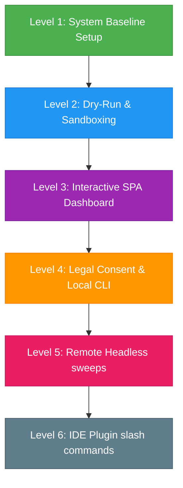

# Master Manual Test Plan & Regression Checklist

This document is the high-level manual testing index for **Repo Wizard** (`repo-wizard`). It is designed to verify the entire system from core baselines up to live agent workflows and UI dashboard integrations.

Detailed step-by-step procedures for individual complex features are located in [tests/manual/features/](features/).

---

## Testing Order Roadmap

To verify components incrementally and minimize risk, execute tests in this order:



---

## Level 1: System Baseline & Environment Setup (Quick & Local)

**Goal**: Verify that your developer environment is correctly bootstrapped, git hooks are active, and the core zero-dependency utilities execute.

- [ ] **1.1 Prerequisite Setup Script**
  - Run the local setup script in your terminal:
    - On PowerShell: `.\setup.ps1`
    - On Bash/macOS: `./setup.sh`
  - *Expected Outcome*:
    - Verification logs checking for Node.js, Git, and NPM.
    - Prints: `✓ Environment pre-flight checks passed successfully.`
    - Prints: `✓ Git hook installation complete.`

- [ ] **1.2 Static Linters & Code Integrity Gates**
  - Run all four static validation scripts:
    ```bash
    node scripts/validate-agents.js
    node scripts/validate-commands.js
    node scripts/validate-skills.js
    node scripts/validate-docs.js
    ```
  - *Expected Outcome*:
    - `validate-agents.js`: Outputs checked agent list and returns `0 error(s) found`.
    - `validate-commands.js`: Outputs `25 commands checked — 0 error(s) — PASSED`.
    - `validate-skills.js`: Outputs `28 skills checked — 0 error(s) found`.
    - `validate-docs.js`: Outputs `✓ All documentation upkeep audits passed successfully.`

- [ ] **1.3 Zero-Dependency Markdown-to-HTML Compiler**
  - Compile a test guide to HTML:
    ```bash
    node scripts/md-to-html.js docs/TESTING.md docs/TESTING.html
    ```
  - *Expected Outcome*:
    - Terminal prints: `Successfully compiled: TESTING.md -> TESTING.html`.
    - Open `docs/TESTING.html` in your browser; verify it renders with premium dark-themed styling, headings, and tables.
    - Run `git status` and verify `docs/TESTING.html` does **not** show up as an untracked file (fully ignored by `.gitignore`).

---

## Level 2: Dry-Run Integration & Sandbox Testing (Mocks)

**Goal**: Verify that subagent parallel spawning, contract schemas, git rollbacks, and sandboxes work in mock mode without invoking external APIs.
*For detailed step-by-step procedures, see [features/scaffolding-rollback.md](features/scaffolding-rollback.md) and [features/prompt-injection.md](features/prompt-injection.md).*

- [ ] **2.1 Contract Schema Validation & Mocking Harness**
  - Run the contract validation and mock sweep harness:
    ```bash
    node scripts/validate-contracts.js
    node scripts/run-mock-harness.js
    ```
  - *Expected Outcome*:
    - `validate-contracts.js`: Outputs `All contract validator self-tests passed.`
    - `run-mock-harness.js`: Simulates 18 specialist contracts in both scaffold and backlog mode.
    - Verify that mock report files are generated at `.repo-wizard/agents/observations-*-temp_mock_repo.md`.

- [ ] **2.2 E2E Sandbox Test Runner**
  - Run the integration test suite:
    ```bash
    node scripts/run-e2e-tests.js
    ```
  - *Expected Outcome*:
    - Spawns an isolated `temp_e2e_sandbox/` workspace.
    - Runs all 16 test assertions (including Git hygiene, history archiving, presets, parallel tasks, and prompt injection filters).
    - Prints: `E2E Sandbox tests complete: 16 / 16 assertions passed.`

---

## Level 3: Interactive SPA Dashboard (UI & Express API)

**Goal**: Run the React SPA web interface, start the Node.js Express server, select a repository, and click through the onboarding interview to generate a session state file on disk.
*For detailed step-by-step UI scripts, see [features/dashboard.md](features/dashboard.md).*

- [ ] **3.1 API Server Dynamic Port Binding**
  - Start the Express backend:
    ```bash
    node scripts/dashboard-server.js
    ```
  - *Expected Outcome*:
    - Binds to port `3000` (or `3001` if `3000` is occupied) and outputs:
      ```text
      Repo Wizard Interactive Dashboard is Live!
      Access URL: http://localhost:3000
      ```

- [ ] **3.2 React SPA Client Interface**
  - Open the Access URL in your web browser (or `npm run dev` port if modifying dashboard source code).
  - *Expected Outcome*:
    - The browser loads the Workspace Picker page.
    - No console errors are present in your browser's Developer Tools.

- [ ] **3.3 Onboarding Questionnaire & Session State Sync**
  - Paste the absolute path of your active repository (e.g., `/absolute/path/to/your/repo-wizard` or similar) in the Workspace input and click **Select**.
  - Click through steps: select operational context, compliance targets, adjust the friction slider, and save settings.
  - *Expected Outcome*:
    - UI confirms settings are saved.
    - Open `.repo-wizard/session.json` in your editor; verify it contains a JSON payload reflecting your UI choices.

---

## Level 4: Legal Consent & Local CLI Sweeps (Real Execution)

**Goal**: Verify that the Step 0 Consent Gate blocks unauthorized scans, prompts for acceptance, writes the state file, and executes a local headless scan with TTY/non-TTY detection.
*For detailed step-by-step procedures, see [features/hybrid-orchestration.md](features/hybrid-orchestration.md).*

- [ ] **4.1 Step 0 Legal Consent Gate Block**
  - Delete the consent agreement file if it exists:
    ```bash
    # PowerShell
    Remove-Item -Path .repo-wizard/.tos_agreed -ErrorAction SilentlyContinue
    # Bash
    rm -f .repo-wizard/.tos_agreed
    ```
  - Trigger a local scan in your terminal (using the Antigravity CLI or your execution runner):
    ```bash
    agy run /repo-wizard
    ```
  - *Expected Outcome*:
    - The agent halts execution immediately, displays the standard disclaimer, and prompts: `Do you accept these terms? (y/N)`.
    - Respond with `n`. The command must exit with a refusal error and **not** run any scan.

- [ ] **4.2 Step 0 Consent Acceptance**
  - Run the `agy run /repo-wizard` command again. When prompted, type `y` and press Enter.
  - *Expected Outcome*:
    - Creates a JSON file at `.repo-wizard/.tos_agreed` containing:
      ```json
      {
        "agreed_by": "dev-user",
        "timestamp": "..."
      }
      ```
    - The scan proceeds past Step 0 into Step 1.

- [ ] **4.3 Headless Local Scan & Progress Indicator (TTY vs Non-TTY)**
  - Run the headless local command in a standard interactive terminal (TTY):
    ```bash
    agy run /repo-wizard --headless
    ```
  - Run the headless local command piping output to a text file (Non-TTY):
    ```bash
    agy run /repo-wizard --headless > scan-output.log
    ```
  - *Expected Outcome*:
    - **TTY (Interactive Terminal)**: Renders a live, smooth progress bar updating in-place.
    - **Non-TTY (Piped Log File)**: Prints clean, line-by-line milestones without control characters. Open `scan-output.log` and verify it contains clean logs.

---

## Level 5: Remote Headless Scan (Remote Profiling)

**Goal**: Verify that scanning remote repositories compiles correct observation summaries, full reports, and roadmap upgrade hooks.
*For detailed step-by-step procedures, see [features/backlog-exporter.md](features/backlog-exporter.md).*

- [ ] **5.1 Remote Profiling Scan**
  - Run the remote scanner command by passing a public GitHub URL (e.g. `https://github.com/expressjs/express` or a small test repo):
    ```bash
    agy run /repo-wizard https://github.com/expressjs/express
    ```
  - *Expected Outcome*:
    - Prompts for Approach A (shallow clone) or B (metadata check), clones the repository, and dispatches the relevant subagent sweeps.
    - Generates a full Markdown report at `.repo-wizard/reports/repo-wizard-full-report.md` containing the executive summary, domain coverage list, and developer disclaimers.

---

## Level 6: Specialist Slash Commands & IDE Integrations

**Goal**: Verify that specialists and individual commands can be triggered directly in your IDE chat or terminal windows.
*For detailed step-by-step procedures, see [features/agent-alignment.md](features/agent-alignment.md).*

- [ ] **6.1 Individual Slash Commands**
  - Trigger one of the individual specialist commands in your agent environment chat input:
    ```bash
    /rw-legal-neutrality
    ```
  - *Expected Outcome*:
    - The agent adopts the `legal-neutrality-agent` persona and references the `legal-neutrality-scanner` skill.
    - Prompts you with the scoping alignment question (file extensions, keywords, target languages).
    - Perform the scan and verify it groups results in batches of no more than 20.
